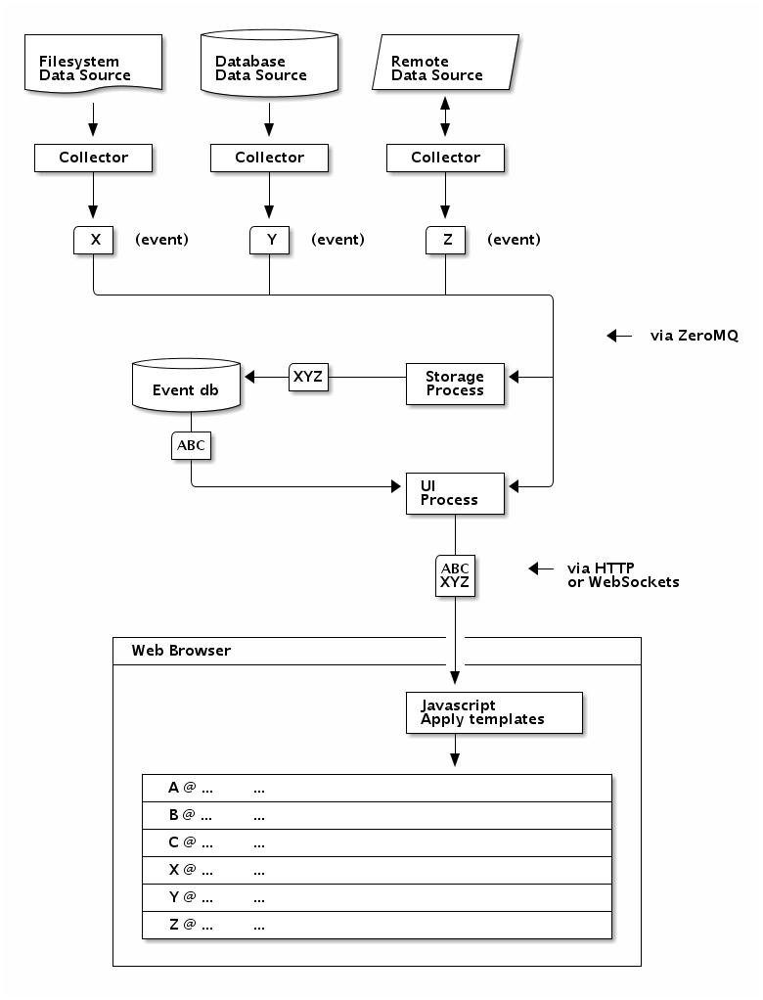

Welcome to Crème de Flux's documentation!
=========================================

Contents:

.. toctree::
   :maxdepth: 2

Introduction
============

..  note::

    This is a lot of "what is to be".

Crème de Flux (or "CDF")
aims to provide an automated journal
based on your lifestream,
and to publish separate editions
for each part of your life.

Here are some things CDF may do to accomplish this goal:

- Aggregate lifestream sources using agents called "collectors":

  Collectors listen for changes in data sources,
  and transforms them into "event" data
  suitable for your stream.

  Examples include:

  - Code repository commits
  - Issue tracker submissions
  - Invoice timer start/stop events
  - Skype chats
  - Web browser history
  - Email sent
  - Tweets / Facebook posts
  - Weather conditions
  - Screenshots
  - Evernote notes
  - Audio notes

- Serve you a live view of your complete stream:

  As events enter the stream,
  your web browser will display them.

  Each collector gives its events a "type"
  which is used to select templates and CSS styles
  when rendering each event.

- Allow annotation of your stream in the live view:

  - Comment at any point in the stream.
  - Comment about any event in the stream.
  - Start/stop ad hoc events.

- Provide tools for publishing separate editions:

  You'll always have a "personal" edition,
  which by default will contain your entire stream.

  Easily mark individual events as personal-only,
  which will prevent them
  from appearing in any other edition.

  Delete events that you do not want to keep at all.

  Select spans of time,
  and attach them to one or more other editions.
  Elect to continue including detail in your personal edition,
  or to only provide a summary.

  For example, one could have these editions:

  - Personal:

    Include entire stream,
    except for confidential client work
    which is only summarized.

    Suitable for long-term storage.

  - Public:

    Include all events marked for the "public" edition,
    except for individually-excluded events.

    Showcase projects you're contributing to,
    or interesting things you've found.

  - Consultancy:

    Include all events marked for each client's edition,
    except for individually-excluded events.

    Use it for your own purposes,
    or share it with your client.

    When your contract expires and you need to clean up,
    only a summary was included in your personal edition.

Architecture
------------

    An overview of the proposed CDF architecture.

    Three collectors receive data
    from different kinds of data sources.
    The collectors generate events
    and publish them via ZeroMQ.

    A storage process receives events
    and stores them in a database.

    A UI process receives events,
    and also retrieves past events from the database,
    then transmits them to a web page
    via HTTP or WebSockets.

    JavaScript in the web browser
    applies event data to templates,
    then renders events in chronological order.

Indices and tables
==================

* :ref:`genindex`
* :ref:`modindex`
* :ref:`search`
